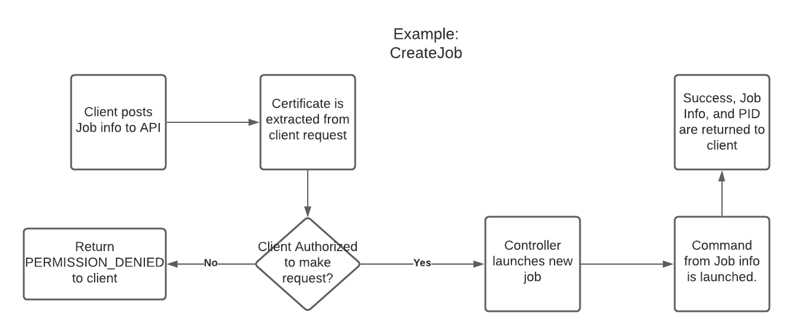

# RPC
This project implements an RPC server in Go using gRPC as a transport.

# Design
What follows is a design document outlining the technology choices, architecture, and implementation of the RPC client and server. 

## Authentication and Authorization
The RPC service includes mutual TLS authentication. The client and server will both have their own private keys as well as certificates signed by the same CA. The minimum TLS version will be set to TLS1.2. In order to protect against downgrade attacks in TLS1.2, an allowlist will be used for ciphers. Conveniently, the Go TLS package will return a list of all cipher suites it implements excluding suites with known security issues (tls.CipherSuites()). In order to restrict the client to using these only, PreferServerCipherSuites will be set to true in the server TLS configuration. If this were a production application, an endpoint would be included in the API to accept a certificate revocation list, allowing the administrator to 'ban' certain clients. 

For Authorization, a simple form of role based access control will be implemented: Each role will have its own CA. All CAs will be trusted by the server. Upon handling a remote procedure call, the server will first check the client certificate's certificate authority and compare it to its internal mapping of certificate authority to privilege level. The following roles will be implemented:

- **Read only:** this role can get job output, but not create or delete jobs. This is useful for automated tooling such as status indicators and job notifiers.
- **Read/Write access:** this role can get job output as well as create and delete jobs. This role is useful for administrators and any kind of deployment automation that would leverage this service.


## API
### Endpoints
The API exposed by the RPC service will contain the following endpoints. Any errors mentioned refer to the [gRPC status codes](https://developers.google.com/maps-booking/reference/grpc-api/status_codes).

#### **CreateJob**
Receives a Command and returns a Job. Can return the following errors:

- PERMISSION_DENIED: the client certificate is not signed by a CA that permits the read/write role
- ABORTED: the command failed to launch

#### **DeleteJob**
Receives a JID and returns a Job. Can return the following errors:

- PERMISSION_DENIED: the client certificate is not signed by a CA that permits the read/write role
- NOT_FOUND: the JID was not found in the process cache

After DeleteJob is run, the Job will be completely deallocated from the RPC system.

#### **ListJobs**
Returns a JobList. 

#### **GetJob**
Receives a JID and returns a Job (including updated job output and execution time).

### Datatypes
- **JID**
    Single integer representing the ID of the Job as tracked by the RPC subsystem. Custom Job IDs were added to the implementation because it could not be assured that every Job would have a unique PID for the underlying process. 
- **Command**
    String that holds a shell command to be executed on the host system
- **Status**
    Enumeration that can hold the following values:
    - Created
    - In Process
    - Stopped
    - Exited
    - Error
- **Job**
    - Command (string):
    Command holds a valid shell command that is run on the underlying server shell.   
    - JID (integer):
    JID holds an integer representing job ID. 
    - CreatedTime (timestamp):
    Timestamp that represents when the process was launched on the server
    - JobExecutionTime (timestamp):
    Timestamp that represents how long the underlying process has been running
    - FinishedTime (timestamp):
    Timestamp that represents when a Job finished
    - Status (status):
    Instance of status enumeration. Represents state of job
    - Output (string):
    Output contains the output of the job at time it is retrieved
    - Exit (integer):
    Exit code as returned from the underlying process
- **JobList**
    - Jobs ([]Job):
    A list of Job obejcts as defined above in this list

### Data flow
Each handler will receive the endpoint input as well as a context object from which the client certificate and trust chain can be extracted. After the Authorization routine is applied to the CA certificate found in the client certificate trust chain, the handler will process the input and return the output.



## Controller
The backend will leverage the CommandContext type from the os/exec package. This will provide convenient facilities for cancelling running jobs and garnering job output. Additionally, it will handle passing through environment variables for us.

A single datatype, JobCtl, will be defined to contain the following peices of data:

- The os/exec CommandContext instance
- The cancel function derived from the context passed into the CommandContext instance
- The "Job" instance as defined in the API datatypes.
    
A map will be used to cache JobCtl objects. The JobCtl objects will be mapped to their JID. A mutex will be used to synchronize concurrent access to the cache. Methods will be defined to retrieve API Job objects, create new JobCtls, delete existing JobCtls, and fetch output from a JobCtl.

## Client
A command line client will be created from the compiled client library stub code. The command line client will use arguments for RPC calls and their arguments. The client will then expect certificates to be defined in environment variables. 

Below is a list of important environment variables:

- CLIENT_CERT: filepath to the certificate used by the client
- CLIENT_KEY: filepath to the private key used by the client
- SERVER_CA: filepath to the CA cert that signs the server cert

Below is a list of important arguments:

- op: requested remote procedure. One of {CreateJob, ListJobs, GetJob, DeleteJob}.
- arg: Optional argument for the remote procedure. Argument could be a JID or a shell command

Below are some examples of CLI invocations:

```sh
$ export CLIENT_KEY=certs/ro_key.key
$ export CLIENT_CERT=certs/ro_cert.pem
$ export SERVER_CA=certs/server_ca.pem
$ rpc_client --op ListJobs
(Jobs listed here, as defined in the API Datatypes section)

$ rpc_client --op CreateJob --arg "uname -a"
(Created Job shown here, as defined in the API Datatypes section)

$ export CLIENT_KEY=certs/rw_key.key
$ export CLIENT_CERT=certs/rw_cert.pem
$ rpc_client --op DeleteJob --arg "13"
(Deleted Job shown here, as defined in the API Datatypes section)
```

## Build environment
This project will be built and tested on a standard debian installation. A Makefile will be leveraged to automate building and testing. At least two Makefile targets will be included: make build and make test.
